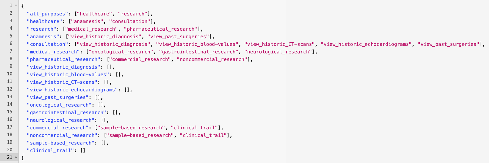
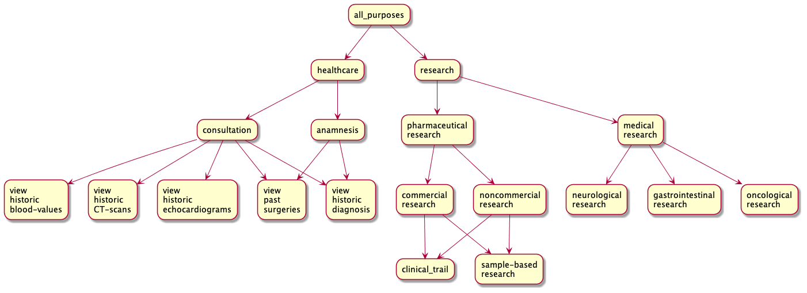

# json2puml

little helper to convert [DAGs](https://en.wikipedia.org/wiki/Directed_acyclic_graph) represented in a JSON file into a [PlantUML](https://plantuml.com/) SVG file.

### install dependencies

    no dependencies to install

### usage

    python json2puml.py <file.json>

converts a JSON representation of a directed acyclic graph like this:

into a PlantUML svg that renders to this:

